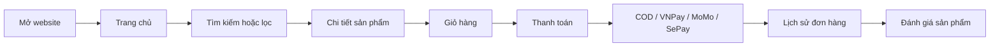

# TechStore Customer Web

![TechStore Customer Web][img-brand]

![.NET 10][badge-dotnet]
![ASP.NET Core MVC][badge-aspnet]
![Tailwind CSS][badge-tailwind]
![SQL Server][badge-sqlserver]
![Firebase Auth][badge-firebase]

Website thương mại điện tử thiết bị điện tử dành cho khách hàng. Dự án
tập trung vào trải nghiệm mua sắm hiện đại với storefront, danh mục,
tìm kiếm CBA, gợi ý Apriori, giỏ hàng, thanh toán và tài khoản khách
hàng.

![Preview trang chủ TechStore][img-home]

---

## Tổng quan

**TechStore Customer Web** mô phỏng một cửa hàng trực tuyến hoàn chỉnh.
Khách hàng có thể xem trang chủ, duyệt danh mục, tìm kiếm sản phẩm, xem
chi tiết sản phẩm, thêm vào giỏ, chọn sản phẩm thanh toán, theo dõi tài
khoản, xem lịch sử đơn hàng và đánh giá sau mua.

Dự án hỗ trợ hai chế độ dữ liệu.

### Mock data

Cấu hình `UseMockData = true`.

- Dùng để demo nhanh sau khi clone.
- Không yêu cầu SQL Server.
- Phù hợp kiểm tra giao diện, danh mục, tìm kiếm, sản phẩm và giỏ hàng
  demo.

### Database thật

Cấu hình `UseMockData = false`.

- Dùng SQL Server thông qua Entity Framework Core.
- Phù hợp kiểm thử đơn hàng, tồn kho, thanh toán, đánh giá và lịch sử
  mua.

---

## Logo và nhận diện

Logo chính nằm trong mã nguồn tại:

```text
wwwroot/images/logo-techstore.svg
wwwroot/images/logo-techstore-icon.svg
```

README sử dụng thêm banner riêng cho nền sáng:

```text
docs/images/readme/techstore-readme-logo.svg
```

Nhận diện TechStore dùng sắc đỏ năng lượng, bố cục rõ ràng và giao diện
tập trung vào thao tác mua sắm nhanh. Logo được đưa lên đầu README để
người xem nhận ra thương hiệu ngay khi mở repository.

---

## Giao diện web

Các ảnh dưới đây được chụp trực tiếp từ ứng dụng đang chạy ở chế độ dữ
liệu mẫu.

### Trang chủ desktop

![Trang chủ TechStore desktop][img-home]

### Trang chủ mobile

![Trang chủ TechStore mobile][img-mobile]

### Mega menu danh mục

![Mega menu danh mục sản phẩm][img-menu]

### Danh mục sản phẩm

![Trang danh mục sản phẩm][img-catalog]

### Ảnh tìm kiếm CBA

![Trang kết quả tìm kiếm CBA][img-search]

### Chi tiết sản phẩm

![Trang chi tiết sản phẩm][img-product]

### Giỏ hàng demo

![Trang giỏ hàng demo][img-cart]

### Đăng nhập

![Trang đăng nhập][img-login]

### Đăng ký

![Trang đăng ký][img-register]

---

## Điểm nổi bật

- **Storefront responsive:** giao diện mua sắm hiện đại, có desktop,
  mobile, hero slider, banner, danh mục và sản phẩm nổi bật.
- **Mega menu danh mục:** điều hướng nhanh theo nhóm sản phẩm, thương
  hiệu, dòng sản phẩm và khoảng giá.
- **Tìm kiếm CBA:** xếp hạng sản phẩm theo nội dung, hỗ trợ tiếng Việt
  không dấu, alias, SKU, brand, category và intent giá.
- **Apriori recommendation:** gợi ý phụ kiện mua cùng dựa trên lịch sử
  đơn hàng và luật tương thích sản phẩm.
- **Cart và checkout:** hỗ trợ giỏ hàng, mua ngay, chọn một phần giỏ
  hàng để thanh toán, voucher và phí vận chuyển.
- **Payment integrations:** hỗ trợ COD, VNPay, MoMo, SePay và webhook
  xác nhận chuyển khoản.
- **Customer account:** hỗ trợ đăng nhập, đăng ký, hồ sơ, địa chỉ, lịch
  sử đơn hàng và đánh giá sản phẩm.
- **AI support:** chatbot hỗ trợ khách hàng và kết nối luồng tin nhắn qua
  SignalR.

---

## Tính năng chính

### Trải nghiệm mua sắm

- Trang chủ có hero slider, sidebar danh mục, campaign tab, banner
  khuyến mãi và nhiều khu vực sản phẩm nổi bật.
- Mega menu danh mục hỗ trợ nhóm sản phẩm, thương hiệu, dòng nổi bật và
  khoảng giá.
- Trang danh mục hỗ trợ lọc theo thương hiệu, thuộc tính, tồn kho, sản
  phẩm mới, sắp xếp và phân trang.
- Trang chi tiết sản phẩm hỗ trợ breadcrumb, thư viện ảnh, phiên bản bộ
  nhớ, màu sắc, trạng thái tồn kho, thông số kỹ thuật, đánh giá, hỏi đáp
  và sản phẩm liên quan.
- Giỏ hàng hỗ trợ tăng giảm số lượng, chọn sản phẩm để thanh toán, mua
  ngay và gợi ý phụ kiện mua cùng.
- Checkout hỗ trợ thông tin giao hàng, phí vận chuyển, voucher, COD và
  các cổng thanh toán trực tuyến.

### Tìm kiếm CBA

Module tìm kiếm sử dụng **Content-Based Approach** theo hướng rule-based
scoring.

- Chuẩn hóa tiếng Việt và truy vấn không dấu.
- Nhận diện tên sản phẩm, SKU, alias, thương hiệu, danh mục và thông số
  kỹ thuật.
- Mở rộng một số từ đồng nghĩa và ý định mua theo mức giá.
- Xếp hạng kết quả theo độ khớp nội dung, độ phổ biến, giá, tồn kho và
  đánh giá.
- Dùng chung cho trang `/search`, API tải thêm `/search/products` và gợi
  ý nhanh `/search/suggest`.

CBA trong dự án là xếp hạng theo nội dung bằng luật và điểm số. Đây
không phải semantic search hoặc vector embedding.

### Gợi ý sản phẩm Apriori

Ở chế độ database, hệ thống có luồng gợi ý phụ kiện dựa trên lịch sử đơn
hàng.

- Đọc các đơn hàng hợp lệ, loại trừ đơn đã hủy hoặc hoàn.
- Sinh luật kết hợp theo cặp sản phẩm bằng Apriori.
- Dùng `support` và `confidence` để xếp hạng luật gợi ý.
- Kết hợp thêm luật tương thích phụ kiện cho iPhone và iPad.
- Hiển thị ở khu vực sản phẩm liên quan và phụ kiện mua cùng.

### Tài khoản khách hàng

- Giao diện đăng nhập, đăng ký, quên mật khẩu, đăng nhập mạng xã hội,
  magic link và SMS OTP qua Firebase.
- Đồng bộ thông tin người dùng vào session và cookie của web.
- Trang hồ sơ khách hàng có thông tin cá nhân, địa chỉ, lịch sử đơn hàng
  và đánh giá sản phẩm.
- Header hiển thị trạng thái đăng nhập, giỏ hàng và các thao tác nhanh.

### Thanh toán và tích hợp

- **COD:** đặt hàng và thanh toán khi nhận hàng.
- **VNPay:** tạo URL thanh toán, xử lý return và IPN.
- **MoMo:** tạo giao dịch, xử lý callback và IPN.
- **SePay:** tạo màn hình chuyển khoản ngân hàng và nhận webhook xác
  nhận giao dịch.
- **Gemini AI:** chatbot hỗ trợ khách hàng qua khung chat nổi.
- **SignalR:** kết nối luồng tin nhắn khách hàng khi tích hợp với hệ
  thống hỗ trợ.

---

## Luồng hoạt động



---

## Công nghệ sử dụng

- **Backend:** ASP.NET Core MVC, Razor Views, C#.
- **Database:** SQL Server, Entity Framework Core.
- **Frontend:** Tailwind CSS v4, CSS theo component/page, JavaScript
  thuần, Swiper, Bootstrap assets.
- **Authentication:** Firebase Authentication, Firebase Admin SDK,
  Cookie Authentication.
- **Payment:** COD, VNPay, MoMo, SePay.
- **Realtime và AI:** SignalR, Gemini API.

---

## Kiến trúc thư mục

```text
e-commerce-web-customer/
|-- Application/
|   |-- Search/
|   |-- Recommendations/
|   |-- Products/
|   `-- Contracts/
|-- Infrastructure/
|   |-- Account/
|   |-- Cart/
|   |-- Catalog/
|   |-- Home/
|   |-- Integrations/
|   |-- Products/
|   |-- Recommendations/
|   `-- Search/
|-- Controllers/
|-- ViewModels/
|-- Views/
|-- wwwroot/
|-- Data/
|-- docs/images/readme/
`-- Program.cs
```

---

## Cấu hình quan trọng

### Chọn dữ liệu mock hoặc database

Trong `appsettings.json` hoặc `appsettings.Development.json`:

```json
{
  "DatabaseSettings": {
    "UseMockData": true
  }
}
```

- `true`: chạy giao diện bằng dữ liệu mẫu, phù hợp khi mới clone.
- `false`: dùng SQL Server thật, cần cấu hình connection string.

### SQL Server

Khi chạy database thật, cấu hình `ConnectionStrings:DefaultConnection`
theo môi trường của bạn.

```json
{
  "ConnectionStrings": {
    "DefaultConnection": "YOUR_SQL_SERVER_CONNECTION_STRING"
  }
}
```

Nếu có script bổ sung trong `Data/`, hãy chạy script tương ứng trước khi
kiểm thử module liên quan.

```text
Data/20260623_AddSePayWebhookEvents.sql
```

### Firebase

Firebase dùng cho đăng nhập Google, Facebook, email/password, magic link
và SMS OTP.

```json
{
  "Firebase": {
    "ApiKey": "YOUR_FIREBASE_API_KEY",
    "AuthDomain": "YOUR_FIREBASE_AUTH_DOMAIN",
    "ProjectId": "YOUR_FIREBASE_PROJECT_ID",
    "StorageBucket": "YOUR_FIREBASE_STORAGE_BUCKET",
    "MessagingSenderId": "YOUR_FIREBASE_MESSAGING_SENDER_ID",
    "AppId": "YOUR_FIREBASE_APP_ID",
    "MeasurementId": "YOUR_FIREBASE_MEASUREMENT_ID"
  }
}
```

Nếu dùng Firebase Admin SDK, đặt file service account tại:

```text
firebase-admin-key.json
```

Hoặc cấu hình bằng biến môi trường:

```powershell
$env:FIREBASE_ADMIN_KEY = '<noi-dung-json-service-account>'
```

### Customer Messages

`CustomerMessages:Jwt:SigningKey` cần tối thiểu 32 bytes để ứng dụng
khởi động.

```json
{
  "CustomerMessages": {
    "HubUrl": "http://localhost:5081/hubs/customer-messages",
    "Jwt": {
      "Issuer": "TechStore.CustomerWeb",
      "AccessAudience": "TechStore.CustomerMessages",
      "AiReceiptAudience": "TechStore.CustomerMessages.AiReceipt",
      "SigningKey": "CHANGE_ME_MINIMUM_32_BYTES_LONG_SECRET"
    }
  }
}
```

### Thanh toán

Các nhóm cấu hình chính:

- `MoMo`: thông tin partner, access key, secret key và sandbox URL.
- `VNPay`: mã TMN, hash secret và payment URL.
- `SePayWebhook`: chế độ xác thực webhook và secret.
- `SePayPayment`: tài khoản ngân hàng nhận chuyển khoản.

---

## Lệnh phát triển thường dùng

```powershell
dotnet restore
npm ci
dotnet build
dotnet run --launch-profile http
dotnet watch run --launch-profile http
npm run css:build
npm run css:watch
```

Khi build, project tự chạy các bước frontend cần thiết.

- Cài dependency frontend bằng npm nếu thiếu.
- Copy Swiper và SignalR browser assets vào `wwwroot/lib`.
- Biên dịch `wwwroot/css/tailwind.source.css` thành `tailwind.css`.

---

## Ghi chú kiểm thử

- Nên chạy nhanh bằng `UseMockData = true` để kiểm tra giao diện không
  phụ thuộc database.
- Khi kiểm thử luồng đặt hàng thật, cần chuyển `UseMockData = false` và
  kết nối SQL Server.
- Các luồng thanh toán online cần dùng sandbox key tương ứng của VNPay,
  MoMo hoặc SePay.
- Đăng nhập mạng xã hội, magic link và SMS OTP cần Firebase project đã
  bật provider tương ứng.

---

## Hướng dẫn clone về để chạy

### 1. Clone source code

```powershell
git clone <URL_REPOSITORY>
cd e-commerce-web-customer
```

### 2. Cài môi trường cần thiết

Cài trước các công cụ sau:

- .NET SDK 10 hoặc mới hơn.
- Node.js 20 hoặc mới hơn.
- npm 10 hoặc mới hơn.
- SQL Server nếu muốn chạy dữ liệu thật.

Kiểm tra phiên bản:

```powershell
dotnet --version
node --version
npm --version
```

### 3. Cài package

```powershell
dotnet restore
npm ci
```

### 4. Cấu hình chạy nhanh bằng dữ liệu mẫu

Mở `appsettings.Development.json` hoặc `appsettings.json`, đặt
`UseMockData` bằng `true`.

```json
{
  "DatabaseSettings": {
    "UseMockData": true
  }
}
```

Có thể dùng biến môi trường PowerShell cho lần chạy hiện tại:

```powershell
$env:DatabaseSettings__UseMockData = "true"
$env:CustomerMessages__Jwt__SigningKey = "CHANGE_ME_MINIMUM_32_BYTES_LONG_SECRET"
```

### 5. Chạy website

```powershell
dotnet run --launch-profile http
```

Mở trình duyệt tại địa chỉ sau:

```text
http://localhost:5132
```

### 6. Chạy với database thật

Đổi `UseMockData` sang `false` và cập nhật connection string.

```json
{
  "DatabaseSettings": {
    "UseMockData": false
  },
  "ConnectionStrings": {
    "DefaultConnection": "YOUR_SQL_SERVER_CONNECTION_STRING"
  }
}
```

Sau đó chạy lại:

```powershell
dotnet run --launch-profile http
```

Khi chạy database thật, hãy đảm bảo database đã có schema và dữ liệu cần
thiết. Các script trong `Data/` cũng cần được áp dụng đúng môi trường.

[badge-dotnet]: https://img.shields.io/badge/.NET-10.0-512BD4
[badge-aspnet]: https://img.shields.io/badge/ASP.NET%20Core-MVC-512BD4
[badge-tailwind]: https://img.shields.io/badge/Tailwind%20CSS-v4-06B6D4
[badge-sqlserver]: https://img.shields.io/badge/SQL%20Server-EF%20Core-CC2927
[badge-firebase]: https://img.shields.io/badge/Firebase-Auth-FFCA28
[img-brand]: ./docs/images/readme/techstore-readme-logo.svg
[img-home]: ./docs/images/readme/01-trang-chu.png
[img-menu]: ./docs/images/readme/02-menu-danh-muc.png
[img-catalog]: ./docs/images/readme/03-danh-muc-san-pham.png
[img-search]: ./docs/images/readme/04-tim-kiem-cba.png
[img-product]: ./docs/images/readme/05-chi-tiet-san-pham.png
[img-cart]: ./docs/images/readme/06-gio-hang-demo.png
[img-login]: ./docs/images/readme/07-dang-nhap.png
[img-register]: ./docs/images/readme/08-dang-ky.png
[img-mobile]: ./docs/images/readme/09-trang-chu-mobile.png
